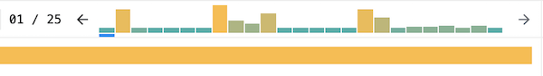
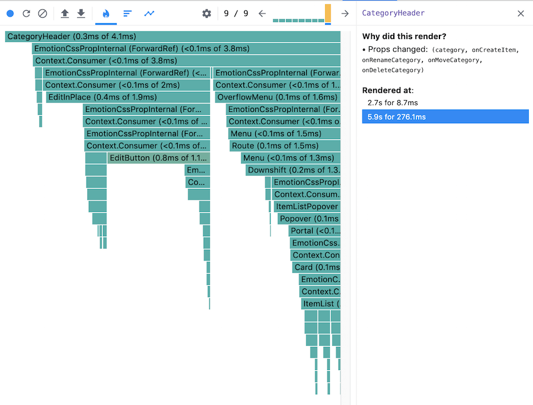
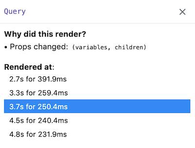
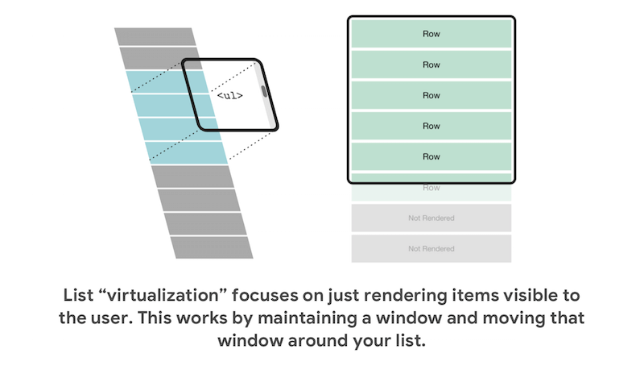

# Render Performance Optimization

## Status

accepted

## Context

What, when, and how to optimize react components.

## Decision

### When to optimize

Before diving into common fixes, it's important to emphasize that you should only spend time fixing
issues that can be measured. There is no point in blindly making "performance improvements" without
a baseline to measure against.

Only when it is proven that a performance issue exists should we consider optimization.

### What to optimize

There are two main phases of the React reconcilliation process that we should concern ourselves with
when optimizing:

The Render phase

- Determines what changes need to be made to the DOM.
- React calls `render` and then compares the result to the previous render

The Commit phase

- When React applies any changes.
- React inserts, updates and removes DOM nodes
- React calls lifecycles and hooks

To investigate performance issues in these areas we can use the React profiler.

What we should look for:

- Which commit took the longest?
- Which components took long to render?
  - Were there multiple component renders and were they necessary rerenders?
  - How much of that time was spent rendering the child components?
  - Are there any large computations causing the render to slow down?
  - While the child components may have rendered quick, is it still taking too long?
- How many components are rerendering?
  - What caused these components to rerender
  - Did the props change, which ones?
  - Did the parent component cause the rerender, should it?

#### Use the React devtools

##### The profiler



- Located above the main chart among the other tools.
- It groups performance info by commit,
- Each commit bar in the chart represents a single commit
- The color and height of each bar corresponds to how long that commit took to render

##### The flame chart



- Represents the state of our application for a particular commit.
- Each bar represents a component that has rendered during this commit
  - The width of a bar represents how much time was spent when the component last rendered
  - The color represents how much time was spent as part of the current commit.

With these tools we can then identify potential areas we can optimize.

Though there is only so much we can see using the provided profiler. To gain further insight we may
need to dig deeper and trace the internals of the code being executed.

We can use `performance.now()` and `console.time()` to measure the performance of a few things.

What should we measure with tracing:

- Custom Hooks
- Utility functions
- Expensive Computational functions
- Pretty much anything inside the `render()` or function component

`performance.now()` will give a more precise measurment, without the convenience of labelling

```javascript
const a = performance.now();
const result = someExpensiveCalculation(data);
const b = performance.now();
console.log('someExpensiveCalculation(data)', b - a);

// someExpensiveCalculation(dat) 0.23
```

`console.time()` may be easier to use, while less precise

```javascript
console.time('someExpenesiveCalculation');
const result = someExpensiveCalculation(data);
console.timeEnd('someExpensiveCalculation');

// someExpensiveCalculation: 2ms - timer ended
```

### How to optimize

Once we've identified areas that need improvements, now comes the time to make the changes. Here are
some best practices I have found on performance optimization in React.



##### Avoiding reconciliation

React builds and maintains an internal representation of the rendered UI. This representation lets
React avoid creating DOM nodes and accessing existing ones beyond necessity, as that can be slower
than operations on JavaScript objects.

- Conditionally firing effects
  - Should this effect happen every render?
- Make fewer state updates
  - Every update leads to a render call, having fewer state updates leads to fewer render calls
- Carefully distributing state, colocating state
  - Moving state closer to where its needed
  - State updates should only re-render the components that depend on it
- Consider breaking apart large objects and pass only the relevant values via props if possible
- Memoization or caching props and state to prevent unnecessary DOM updates
  - Equality can't be checked if there are no references defined
  - React can't make a comparison and re-renders, because the object is created and therefore new on
    every render
  - `useMemo` and `useCallback` are used to create a reference to these objects.
  - We should be mindful of the added cost of creating these references when reaching for
    memoization
- Skip renders with `React.memo` and `PureComponent`
  - Ask ourselves when is it ok for this component to re-render?
  - Most of the time we may want to make our components pure if it is rendering a large tree.

##### Optimize context objects

We should optimize our Context provider values when values change frequently, and if it has many
consumers. Context consuers will always re-render when the Provider's value prop updates.

Actions to optimize this include:

- Reimplement context with dual context state management
  - `useContextState` provides the context value
  - `useContextDispatch` provides the state update function
  - By seperating out state, and state updaters into their own respective hooks we avoid
    re-rendering the components that just use the updater context.
- Caveats to this include added complexity and overhead
  - https://kentcdodds.com/blog/how-to-optimize-your-context-value

```javascript
const CountStateContext = React.createContext();
const CountUpdaterContext = React.createContext();

function CountProvider(props) {
	const [count, setCount] = React.useState(0);
	return (
		<CountStateContext.Provider value={count}>
			<CountUpdaterContext.Provider value={setCount}>{props.children}</CountUpdaterContext.Provider>
		</CountStateContext.Provider>
	);
}

function useCountState() {
	const countState = React.useContext(CountStateContext);
	return countState;
}

function useCountUpdater() {
	const setCount = React.useContext(CountUpdaterContext);
	const increment = React.useCallback(() => setCount(c => c + 1), [setCount]);
	return increment;
}

export { CountProvider, useCountState, useCountUpdater };
```



##### Virtualize long lists

Massive amounts of data, can be virtualized with a windowing technique

- Only renders a small subset of rows or columns at a given time which can reduce the amount of time
  it takes to re-render nodes
- Libraries to consider:
  - [react-window](https://react-window.now.sh/#/examples/list/fixed-size)
  - [react-virtualized](https://bvaughn.github.io/react-virtualized/#/components/Masonry)

## Consequences

We leverage React performance best practices to deliver a high quality performant prodect to our
customers. Improve the user experience and increase revenue due to user happiness. Our users reap
the benefits of less load time and responsive interactivity.

### References

- [Profiling React rendering performance](https://www.youtube.com/watch?v=Q7NEfD4FNYE)
- [Optimizing performance](https://reactjs.org/docs/optimizing-performance.html)
- [Hooks Optimization](https://reactjs.org/docs/hooks-faq.html#performance-optimizations)
- [Colocating state](https://kentcdodds.com/blog/state-colocation-will-make-your-react-app-faster)
- [Rendering large lists with react-window](https://addyosmani.com/blog/react-window/)
- [Website performance optimization](https://www.udacity.com/course/website-performance-optimization--ud884)
- [Browser rendering optimization](https://www.udacity.com/course/browser-rendering-optimization--ud860)
