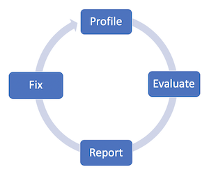
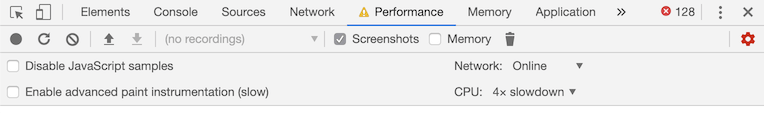
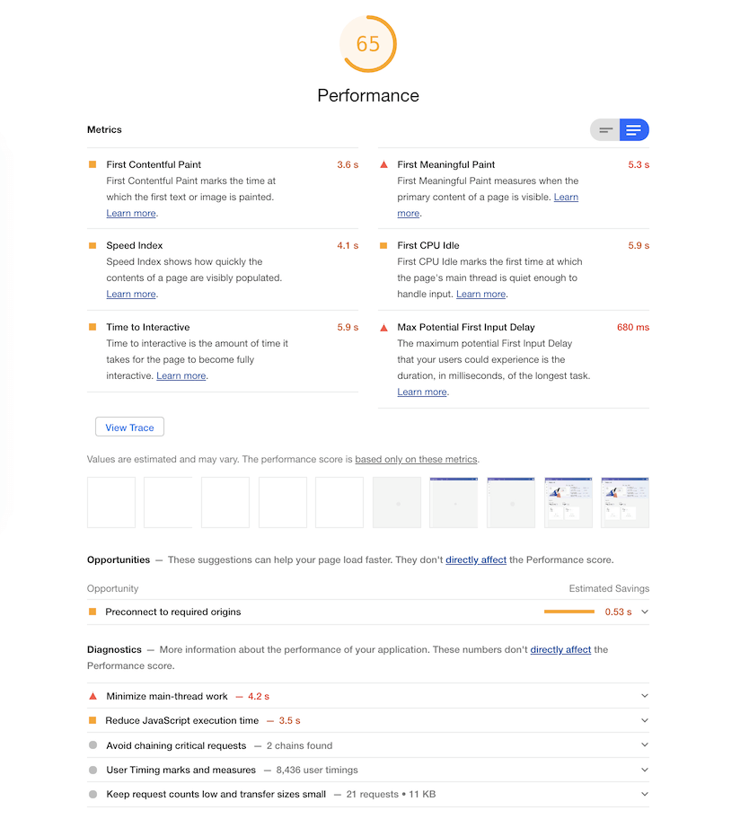
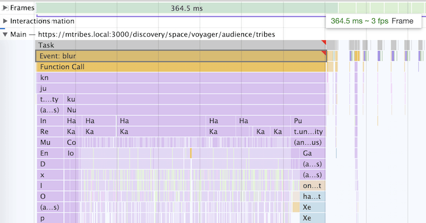
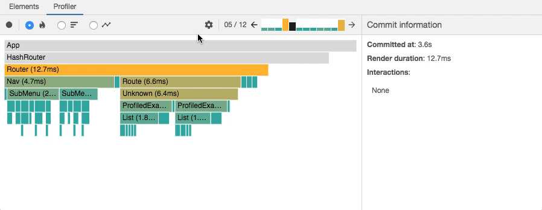

# General Performance Approach

## Status

accepted

## Context

It is inevitable that as our app grows, perceived performance may begin to dwindle with more and
more features added. Regressions in performance may occur when we refactor to fix a bug or make a
small change in code. It is important to know how our app performs, to identify areas where we can
make improvements, and what our actions are to remedy performance issues.

## Decision

### PERF

Profile -> Evaluate -> Report -> Fix

Repeat this cycle until satisfied

### Profile

Once we have our profiling environment setup. We can begin to measure how our app performs.

Throughout this measurement phase we will document our findings in a clickup task If an
architectural change is necessary then the findings will be used in the creation of an ADR.

We'd want to describe the issue with as much supplemental information necessary. So that we can make
a comparison afterwards and share with the wider business as to how impactful our optimizations were
for the web app.

To acquire an accurate representation of our app's performance, we must ensure the usage of a
consistent environment to base our measurements upon.

With regard to specific builds, it's important to be aware of any optimizations made at compile time
on production builds vs development builds.

We should also be mindful of the computing power of our devices, and network connection speed. Also
some browser addons and extensions may affect the accuracy of reporting.

In the future we can integrate an automated profiling system to generate these reports within a
consistent benchmarking environment.

#### General profiling prep

Lighthouse uses a 4x CPU slowdown, and network throttling when selecting `Simulated throttling`
before generating a performance report.

To perform an audit, go to the `Audit` tab in the Chrome devtools and click "Generate report"

We should use the same settings as Lighthouse when profiling in our browser specific dev tools

In Chrome we can configure this in the `Performance` tab, and clicking the settings icon.

##### Cached data

In some cases we may want to profile with or without data stored in cache.

For example, to measure script execution time, and react commits we may not want network requests to
get in the way of these measurements, so we can allow cached data in this case.

Otherwise we may want to measure our initial page load times to view network performance, or we may
want to profile Apollo query and mutation component performance.

#### React profiling prep

React in development mode adds a lot of development-time warnings which come at a cost to
performance. Therefore we should favor a production build when profiling overall end-user
experiences like page loads, and interactions.

By default profiling is not supported on production builds due to further optimizations made by
React to remove the profiler code at compile time.

To enable this we need to make some changes to the webpack config to alias certain modules to the
profiling version of that module, specifically:

- `react-dom` to `react-dom/profiling`
- `scheduler/tracing` to `scheduler/tracing-profiling`

To help us debug our components better we also need to disable function name mangling. This is done
where the `UglifyJsPlugin` is used in the webpack config, by setting the option `mangle: false` so
we can view the component names in the react profiler

We can create a specific branch that is used to profile in production mode. This branch will include
the changes to webpack to allow for profiling in production builds.

I have done this already.

- https://profiling-master.web.mtribes.dev/

For now we have to manually keep the branch up to date with the latest master branch, this could
potentially be automated at some point in the future.

### Evaluate

Once we have our measurements we can begin to decide what areas are ripe for optimization. This
decision can be based on a perceived experience that may be unpleasant to the user. Once we identify
this at a high level we must dig deeper for further investigation as to the root cause. This is were
we use our profiling tools to find the clues that point to the issue.

Lighthouse audits, generate a nice report that we can save, and attach to tickets. It display a lot
of useful info about specific performance metrics, and offers suggestions on how to improve these
metrics. This is a good starting point, to get a general idea about how our app performs, and where
we can make our improvements.

In addition to the lighthouse audit chrome also provides a performance profiler that allows us to
see in detail how our app is performing at a granular level. This will allow us to dig a little
deeper and see each function call, network request, frame rate, main thread work, and more.

The React team also has developed devtools specific to React to help profile and debug performance.

- https://chrome.google.com/webstore/detail/react-developer-tools/fmkadmapgofadopljbjfkapdkoienihi

### Report

In an accompanying performance task we report our findings by outlining the problem and any
solutions to fix the performance issue. Any relevant supplemental information that would help to
generate this report would be valuable in aiding the visibility of this issue and measure the impact
of the solution.

### Fix

Now that we have identified what it is we need to improve, we can then take the next steps to
implement the optimization and refactor the code in question. After these changes have been made, we
then iterate upon the `Measure -> Identify -> Refactor` cycle until performance requirements have
been satisfied.

Upon submission of pull request we attach the before and after benchmarks, and accompanying ticket.

## Consequences

We establish a system to document and remedy performance issues, from discovery to implementation.
We standardize a consistent performance profiling setup as a foundational piece to future
performance analysis. Our users benefit from the perceived performance improvements.

### References

- [React profiling](https://kentcdodds.com/blog/profile-a-react-app-for-performance)
- [How to use React profiler](https://www.youtube.com/watch?v=00RoZflFE34)
- [React Devtools deep dive](https://www.youtube.com/watch?v=nySib7ipZdk)
