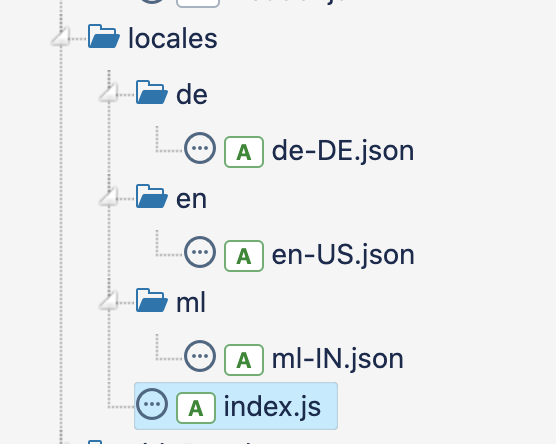
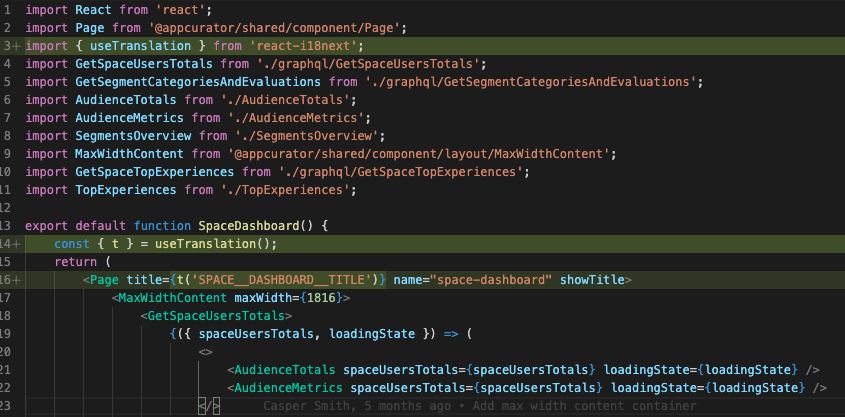

# Internationalization and Localization

## Status

accepted

## Context

Adding i18n and l10n support to **mtribes**. This proposal will look at the different frameworks
currently available, compare them and layout a plan to achieve i18n support.

### Research resources

[This][1] research document details the various parameters considered while evaluating the
frameworks.

## Decision

`i18next` can be used for all internationalization and localization requirements in the
project.`i18next` has all the required features that are expected from an i18n library like
interpolation, formatting and plurals support. Apart from this it also has advanced features like
nesting, rich text formatting, context and namespaces. There are also a number of plugins and
extensions available which can be leveraged across platforms. The only downside with `i18next` at
this time seems to be that it has a slightly higher total package size than `react-intl`.

## Example Usage

Each module will have a locales folder with all the language translation files as below :



The locale will also have an index file which will add the language resource bundles as below. The
locale index file is then imported into the root index file of the module to be bundled with the
module.

```javascript
import { addResources } from '@appcurator/shared/util/i18n';
import languageEn from './en/en-US.json';
import languageDe from './de/de-DE.json';
import languageMl from './ml/ml-IN.json';

export default addResources({ 'de-DE': languageDe, 'en-US': languageEn, 'ml-IN': languageMl });
```

Each language file will have the following convention for translation keys :
`<MODULE_NAME>__<PAGE_NAME>__<LANGUAGE_KEY>`

`<PAGE_NAME>` is optional and can be ommitted for keys which are shared across modules/pages.

For eg: the dashboard title in the space module will have the following key:
`SPACE__DASHBOARD__TITLE`

---

Translation is easily acheived by passing the key to the `t` function returned by the
`useTranslation` hook.



---

Translation files can also have references to values in other files as below:

`"SPACE__DASHBOARD__TITLE": "$t(NAVIGATION__TITLE)"`

---

For usecases which require simple styling of strings the `Trans` component can be used which will
allow simple tags like `<i>`, `<b>` and `<br/>`. We will no longer need to use
`dangerouslySetInnerHTML` for this.

---

## Consequences

`i18next` will help `mtribes` achieve support for additional languages and also organise the strings
in each module for better maintainability.

## Future enhancements

- Adding custom linters to assist in formatting the language keys
- Webpack plugin to compile all the language files automatically to avoid manual imports
- Visual studio extension to provide code actions for generating key formats from selected word.

[1]: ../research/i18n.md
