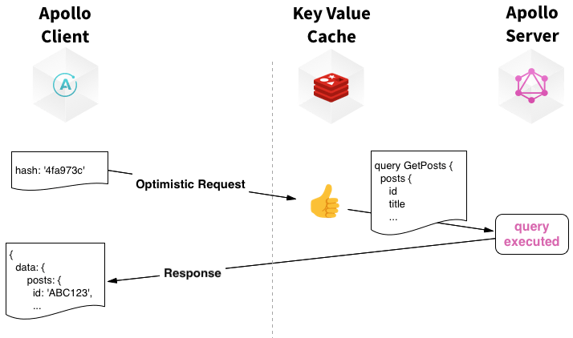
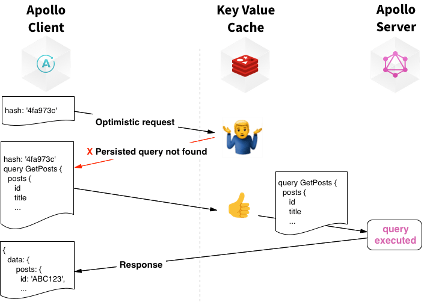

# Automatic Persisted Queries

## Status

accepted

## Context

The individual query string size is a common pain point often attributed to GraphQL API's. Complex
query strings have been known to be as large as 10 kilobytes, that's just the query string alone.
This could negatively impact clients with poor uplink speed by sending requests with very large
query strings in the body.

## Decision

Integrating the ApolloLink provided by the package `apollo-link-persisted-queries` which enables
['automatic persisted queries'](https://www.apollographql.com/docs/apollo-server/performance/apq/)
with no configuration required on the server.

### How it works

The client makes a query, and will optimistically send a short hash instead of the query text.

The server observes the queries when passed to resolvers, and when a request containing a persisted
query is detected, ApolloServer will look it up in cache.

If an entry exists Apollo will then expand the request with the full text of the query and pass it
on to resolvers.

However upon a cache miss, the server will ask the client to resend the reqeust with the full query
text,

The new query is then stored for all subsequent requests in either the default local in-memory store
or an external memcache such as Redis.

An external memcache would become more worthwhile if we start deploying more frequently, or by
introducing a larger number of pods due to the increase in the rate at which new pods are
initialized with fresh caches.

This may present issues of its own, like requiring a round trip to Redis for every single query.
However this may be a quick and cheap lookup, but will definitely require some investigation

### Build time approach

One
[alternative](https://github.com/apollographql/apollo-link-persisted-queries#build-time-generation)
is to maintain generate a map from query to id that helps you determine the id for a given document
and send that to the server instead of the full query string.

While this does optimize the payload sent to the server, the client will still need to load this
mapping at build-time, which may become quite large to load upfront.

This tight coupling of the client and server would require the maintenance of this query mapping,
when new queries are made available, and deprecated. This build step will be required of other
developers that we allow access to our GraphQL API such as mobile/native clients.

This extra build step is handled automatically by the persisted-queries link, by generating unique
ID's on the client.

## Consequences

The client sends a query ID or hash instead of an entire GraphQL query string. This reduces
bandwidth utilization and can speed up loading times for end-users.

Now that we are no longer providing the query string we lose some detail about the query within our
logs.

We’ll need to monitor the rate of requests rejected due to missing cache keys. This is to make sure
the caching is working as expected, and also to have visibility of how frequently this is happening
and if we should consider using Redis
